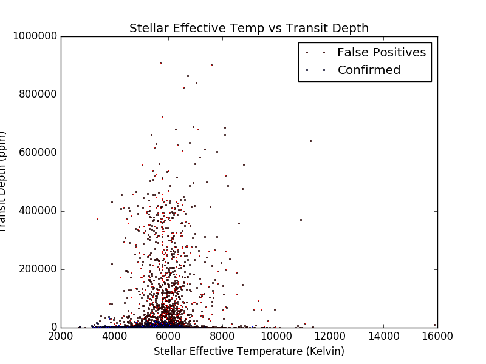
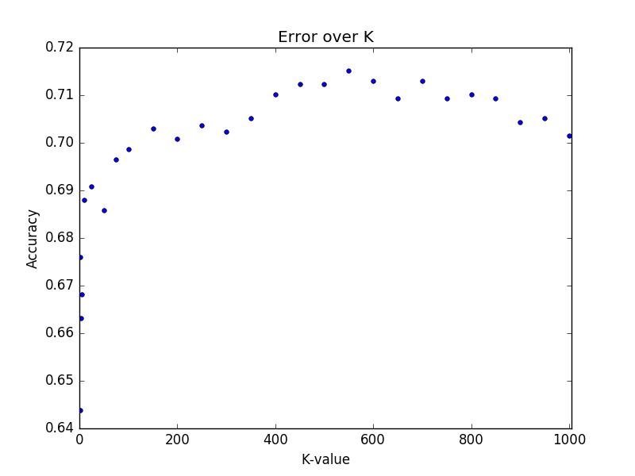

# keplerII
Classifies Kepler objects-of-interest as planets or not, based on data gathered by Nasa's Kepler space observatory.

## Statistical Analysis of Data
Data was pulled from a dataset published on [Kaggle](https://www.kaggle.com/nasa/kepler-exoplanet-search-results). This dataset is a record of all observed Kepler "objects of interest" - all of the approximately 10,000 exoplanet candidates Kepler has taken observations on.

The dataset has 50 data fields for each object of interest. Descriptions of each can be found on the [NASA exoplanet archive](https://exoplanetarchive.ipac.caltech.edu/docs/API_kepcandidate_columns.html).

In total, there were 10 possible unique data fields for each entry:
- ``koi_period`` The interval between consecutive planetary transits.
- ``koi_impact`` The sky-projected distance between the center of the stellar disc and the center of the planet disc at conjunction.
- ``koi_duration`` The duration of the observed transits.
- ``koi_depth`` The fraction of stellar flux lost at the minimum of the planetary transit.
- ``koi_prad`` The radius of the planet.
- ``koi_teq`` Approximation for the temperature of the planet.
- ``koi_insol`` The equilibrium temperature of the planet.
- ``koi_steff`` The photospheric temperature of the star.
- ``koi_slogg`` The base-10 logarithm of the acceleration due to gravity at the surface of the star.
- ``koi_srad`` The photospheric radius of the star.

I attempted to classify exoplanets using two models: logistic regression, and K-Nearest neighbors.

## Logistic Regression Analysis
Before actually implementing the logistic regression myself, I first ran logistic regression on all 10 of the features using sklearn's version of the algorithm. Below are coefficient values, as well as the linear value (coefficient * mean of values) for each feature used in the model:

Features | Coefficient | Linear Value
---------|---------|-----------
koi_period | -1.321e-02 | -7.474e-01
koi_impact | -4.740e-03 | -2.681e-01
koi_duration | -4.677e-02 | -2.645e+00
koi_depth | -2.609e-05 | -1.476e-03
koi_prad | -9.133e-02 | -5.166e+00
koi_teq | -2.047e-03 | -1.158e-01
koi_insol | -1.446e-04 | -8.181e-03
koi_steff | 5.366e-04 | 3.035e-02
koi_slogg | 4.773e-03 | 2.700e-01
koi_srad | 2.365e-03 | 1.338e-02

Looking at coefficients, it seems orbital period, transit duration, and planetary radius were the most powerful predictors, as their coefficient values were the highest.
When cross-validating data, a logistic regression model made from all 10 variables was able to correctly classify exoplanets with an accuracy of approximately 0.830.

I also tried running a model that contained only the 3 most relevant features, but it was only able to correctly classify exoplanets with an accuracy of approximately 0.685.

## Logistic Regression Model Evaluation
###### Confusion Matrix, Precision, Recall, and f1-score
n = 1404 | Predicted: False Positive | Predicted: Planet
---------|---------|-----------
False Positive | 832 | 128
Planet | 92 | 352

This is a confusion matrix from one run of logistic regression, with 80-20 training-test split. Some statistics for this run of the logistic regression:

- Accuracy of 0.843
- Recall of 0.793, Precision of 0.733
- Specificity is 0.867
- Prevalence is 0.316
- F1 score is 0.762

###### Imbalanced Classes
After removing 2248 entries classified as candidates (haven't been classified as planets or false positives yet) and removing 300 entries without some of the necessary data fields, we were left with 7016 entries. Of those, 2292 were confirmed as planets, meaning that 32.7% of our data were planets, and 67.3% were not. It's certainly not an optimal split but at the same time I didn't think this warranted the use of some techniques to use when we have imbalanced data.

## K-Nearest-Neighbors Model
I also tried implementing a K-Nearest-neighbors model that classified based on stellar effective temperature and transit depth.

Essentially, this model locates the k nearest objects to any given data point, and then tallies up the classes of the nearest objects. It then classifies our given data to the class with the most tallies. The two parameters I used were the stellar effective temperature, and the transit depth. The idea was that if we could graph how much the stellar flux was lost, based off of how hot the star was, we could have a better idea of whether or not the object of interest was actually an exoplanet orbiting the star. In the first figure above, we can see that confirmed exoplanets had a relatively lower stellar flux lost in relation the the temperature of the star. We used this idea to try and classify an object of interest as an exoplanet or not based on status of surrounding objects of interest.

## Visualization of Data for K-Nearest-Neighbors
| Visualization of Data             |      K-Value Accuracies  |
|:-------------------------:|:-------------------------:|
|   |     |

The first graph is a plot of transit depth in parts per million, versus stellar effective temperature in Kelvins. The second figure shows the accuracy of our model using different values of k. Before making our model, we removed 300 objects of interest that did not have the fields required from our data.

We can see in the first graph that the majority of planet candidates are clustered near the temperature axis, and there isn't a distinct separation between the confirmed planets and false positives, at least not on these two axis. However, a majority of the candidates with higher transit depths tend to be false positives, which led me to try classifying using KNN based on these two variables.

## K-Optimization and Errors
I tested many different values of K and plotted their accuracy on the second figure found above. The highest accuracy happened around k-value of 550, and it classified with an accuracy of approximately 0.715 on our testing data.

## Changes for Future
Of course, data we can collect on potential planet candidates is always limited, as is our knowledge of space and Kepler's observations. There's only so much we can do with the limitations of our technology and state of existence. As technology improves hopefully so can our ability to discover new planets and, hopefully, many more things about our universe...
